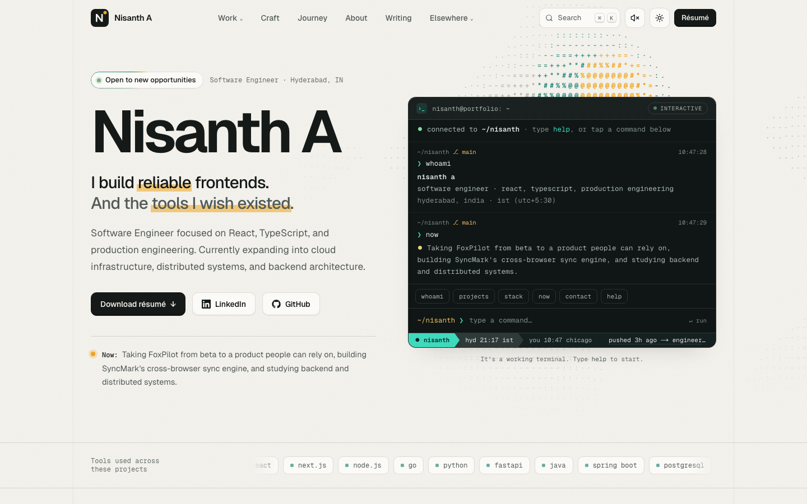

# Nisanth A — Portfolio

Personal portfolio site: a single-page, keyboard-first tour of my work, code, career, research, and how to reach me. Content lives in typed TypeScript modules, sections render on the server, and client JavaScript is reserved for the interactive parts — no UI libraries.

**Repository:** [github.com/nisanth-alla/portfolio](https://github.com/nisanth-alla/portfolio)  
**Live site:** [nisanth-a.vercel.app](https://nisanth-a.vercel.app/)



## Highlights

- **Interactive terminal** in the hero — autoplayed `whoami`, typed commands with tab-completion, history, typo suggestions, clickable command chips, and a tmux-style status line (Hyderabad time, your time, latest GitHub push)
- **Hover tabs** for projects and code: summary rows reveal elaborated case-study panels (why, architecture trace, verified facts, copyable quickstart) on hover / focus / tap, with deep links like `#projects-foxpilot`
- **Craft** section with verbatim code excerpts from my repos, syntax-highlighted on the server (zero client JS), shown in an editor window with a minimap and GitHub line links
- **⌘K command palette**, single-key section shortcuts (toggleable), and a floating "pipeline" dock that tracks reading progress
- **Playable GitHub heatmap** — with sound on, pitch follows the weekday, brightness the activity, and stereo pan the week; arrow keys explore it too
- **Synthesized UI sounds** via the Web Audio API (no audio files, off by default)
- Ambient ASCII field (canvas, glyph atlas, 30fps, paused offscreen), cursor-lit card borders, rolling-number stats, scroll-driven git-log timeline, and a View Transitions theme reveal
- Accessible by default: semantic landmarks, focus management, `prefers-reduced-motion` respected everywhere, content visible without JavaScript. Zero axe-core violations (WCAG 2.1 AA) in both themes
- Resilient: each interactive island sits behind an error boundary, API routes use timeouts, response validation, a fallback data source and CDN caching, and there are custom 404 / error pages
- Pure logic (syntax highlighter, heatmap streaks, fuzzy search, edit distance) is unit-tested with Node's built-in test runner, with no extra dependencies
- Self-hosted Geist and Geist Mono via `next/font/local` (no font network requests)

## On the page

| Section | Purpose |
|--------|---------|
| **Hero** | Name, headline, résumé / LinkedIn / GitHub, "now" line, interactive terminal |
| **Projects** | Case studies in hover tabs |
| **Craft** | Real code excerpts, verbatim from the source repos |
| **Journey** | Career milestones as a `git log --graph` |
| **About** | Bio, highlights, engineering philosophy, stats |
| **Now** | Current focus as a bento of small live widgets |
| **GitHub** | Live contributions, streaks, latest push |
| **Research** | Publications, education, recognition |
| **Writing** | Articles from the Engineering Journal |
| **Contact** | Email, LinkedIn, résumé |

## Tech stack

- [Next.js 16](https://nextjs.org) (App Router, Turbopack) and [React 19.2](https://react.dev/)
- [TypeScript](https://www.typescriptlang.org/)
- [Tailwind CSS v4](https://tailwindcss.com/) with CSS-variable design tokens (light + dark)
- Web Audio API, View Transitions API, Canvas 2D, scroll-driven animations (progressive)

## Project structure

```text
src/
├── app/                     # layout, page, globals.css, 404 / error pages, OG image, icon
│   └── api/                 # github (contributions) and github-commit (latest push) routes
├── components/
│   ├── chrome/              # top nav, dock, command palette, theme/sound toggles, logo
│   ├── hero/                # ASCII field, telemetry status line
│   │   └── terminal/        # Terminal.tsx (UI) + commands.tsx (pure command handling)
│   ├── providers/           # theme, sound and UI (palette, shortcuts) providers
│   ├── sections/            # one component per page section
│   ├── seo/                 # JSON-LD structured data
│   └── ui/                  # feature tabs, windows, code block, error boundary, reveal, ticker…
├── content/                 # copy and data (edit here first)
│   ├── profile.ts           # identity, links, hero, now
│   ├── projects.ts          # case studies (keep facts traceable to each repo)
│   ├── craft.ts             # generated code excerpts (verbatim, with line numbers)
│   ├── nav.ts               # section registry: order, titles, shortcuts
│   └── …                    # about, journey, focus, publications, education, recognition, writing, stack
└── lib/                     # highlighter, contributions, fuzzy search, sfx synth, theme helpers
    ├── server/              # fetch-with-timeout, GitHub headers, cache headers
    └── *.test.ts            # unit tests (node --test)
```

Place `resume.pdf` in `public/` so résumé links resolve to `/resume.pdf`.

## Local development

Requires Node.js 20+ (LTS recommended).

```bash
npm install
npm run dev
```

Open [http://localhost:3000](http://localhost:3000). Press <kbd>⌘</kbd> <kbd>K</kbd> (or <kbd>Ctrl</kbd> <kbd>K</kbd>) anywhere, or type `help` in the terminal.

Other scripts:

```bash
npm run lint        # ESLint
npm run typecheck   # TypeScript, no emit
npm test            # unit tests (Node's built-in runner, Node 22.18+)
npm run build       # production build
npm run verify      # all of the above, in order (what CI runs)
npm run start       # serve the production build locally
```

### Environment

Copy `.env.example` to `.env.local`. Both variables are optional:

| Variable | Purpose |
|---|---|
| `NEXT_PUBLIC_SITE_URL` | Canonical URL for metadata, sitemap and robots.txt |
| `GITHUB_TOKEN` | Raises the GitHub API rate limit for the "latest push" widget (server-only, no scopes needed) |

## Deployment

Optimized for [Vercel](https://vercel.com): connect this repository, use the default Next.js settings, deploy. Set `NEXT_PUBLIC_SITE_URL` to the domain you want search engines to treat as canonical.

## Contact

- [LinkedIn](https://www.linkedin.com/in/nisanth-alla/)
- [GitHub](https://github.com/nisanth-alla)
- nisanth.alla@gmail.com

## License

MIT
